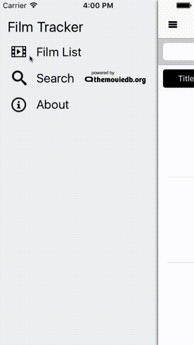
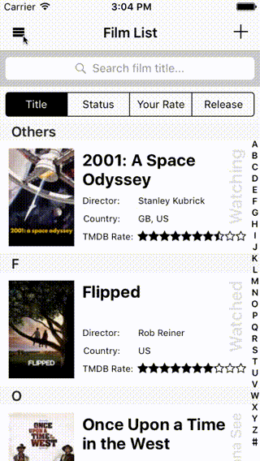
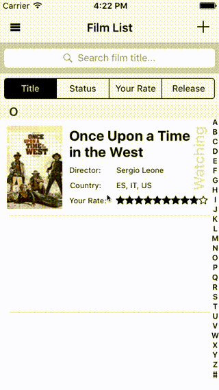
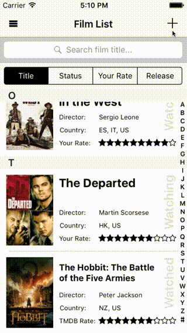
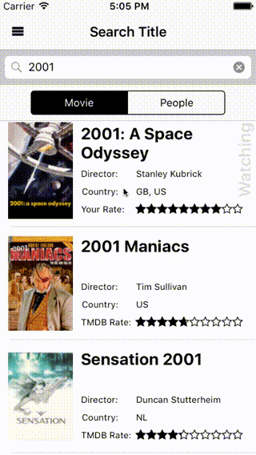

# Film Tracker

Film Tracker is an app helps to track watched movies.
Firstly, it searches the movie with movie title or actors / directors. Once picking the watched movie, the movie will be added to the database with detailed information retrieved from TMDB. The app has updated to Swift 2.0, Xcode 6 may not be able to run the program, please update to Xcode 7.

##### Search Title:

##### Search Saved Title on Spotlight (iOS 9 only):

##### Edit Title:

##### Add Customised Title:

##### Browse Title

##### Mechanism of the controllers:
- MovieListViewController: NSFetchedResultsController and UISearchController work with NSPredicate and Transient Properties;
- SearchViewController: KVO to monitor NSManagedObjectContext, works with Search class which used to parse JSON;
- DetailViewController and SearchResultCell: FloatRatingView to set the ratings;
- EditTitleViewController: several pickers, NSUserDefaults to store genres and countries settings data
- Core Spotlight: index searchableItem when add / edit film, deindex searchableItem when delete film object; call `continueUserActivity` in AppDelegate, `Core Spotlight` will generate userActivity automatically when selecting the search result on Spotlight.

##### Credits
- [SWRevealViewController](https://github.com/John-Lluch/SWRevealViewController): Slide-out navigation controller.
- [FloatRatingView](https://github.com/strekfus/FloatRatingView): FloatRatingView
- [Ico-Moon](https://github.com/Keyamoon/IcoMoon-Free): Images and icons
